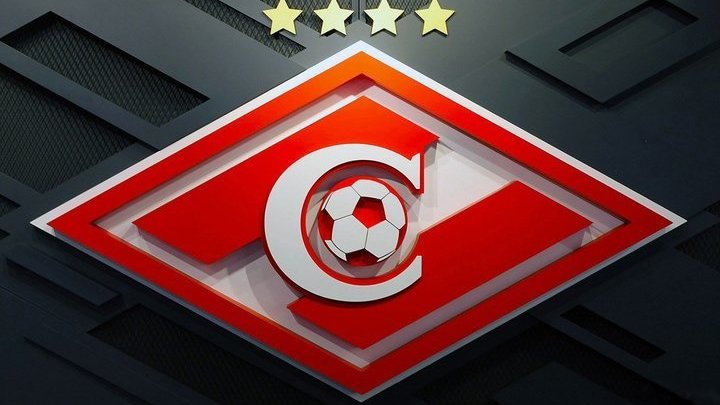
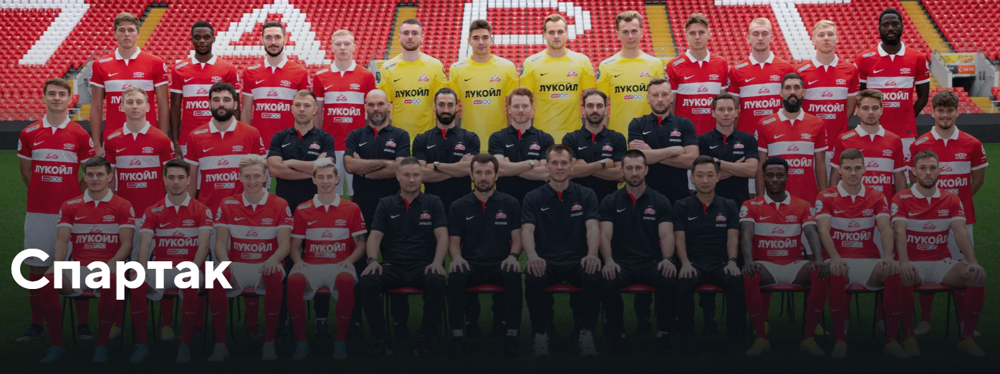
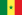

# **[ФК Спартак Москва](https://spartak.com/)**

## *Основной состав:*

### **Вратари**

- Антон Шитов (31) 
- Александр Селихов (57) 
- Александр Максименко (98) 
___
### **Защитники**

- Алексис Дуарте (4) 
- Леон Классен (5) 
- Георгий Джикия (14) 
- Томаш Тавариш (20) 
- Никита Чернов (23) 
- Павел Маслов (39) 
___
### **Полузащитники**

- Виктор Мозес (8) 
- Квинси Промес (10) 
- Мацей Рыбус (13) 
- Антон Зиньковский (17) 
- Наиль Умяров (18) 
- Михаил Игнатов (22) 
- Данил Пруцев (25) 
- Кристофер Мартинс (35) 
- Роман Зобнин (47) 
- Руслан Литвинов (68) 
- Даниил Хлусевич (82) 
- Даниил Зорин (87) 
- Даниил Денисов (97) 
___
### **Нападающие**

- Александр Соболев (7) 
- Кейта Бальде (9) 
- Шамар Николсон (11) 
- Павел Милешин (70) 
___
### **Главный тренер**

- Гильермо Абаскаль 